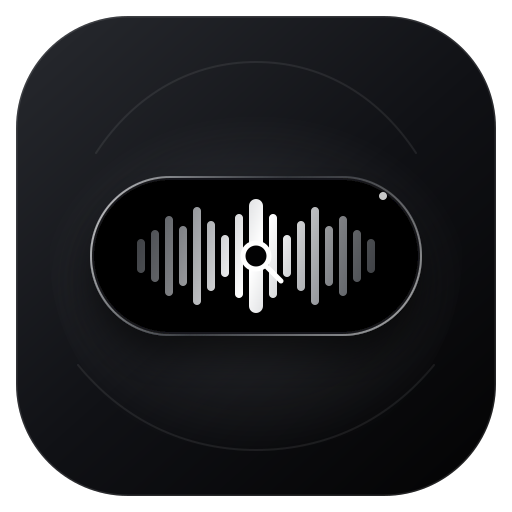
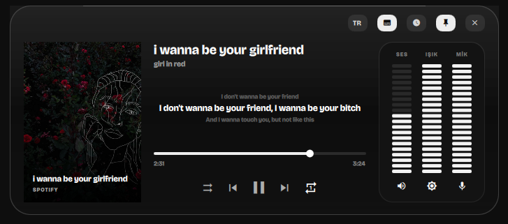
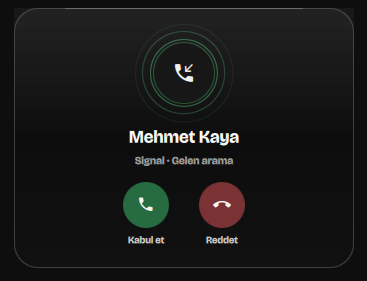
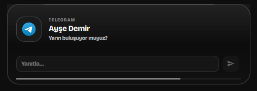
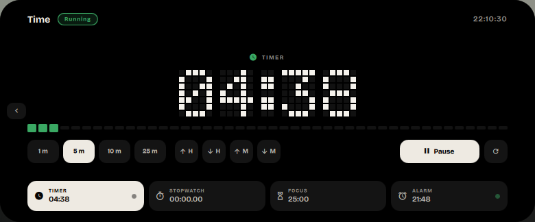
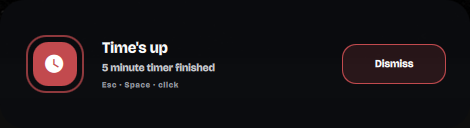
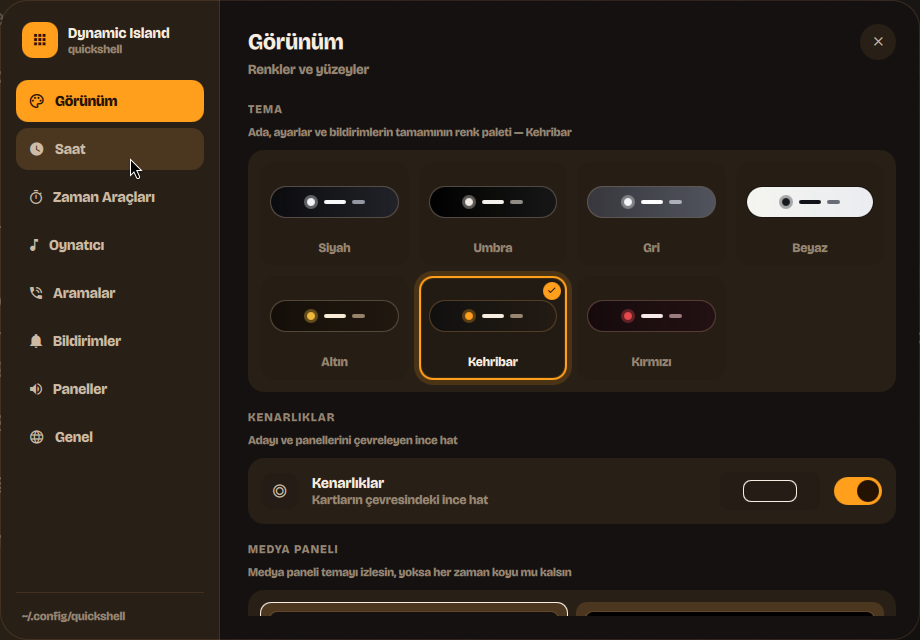
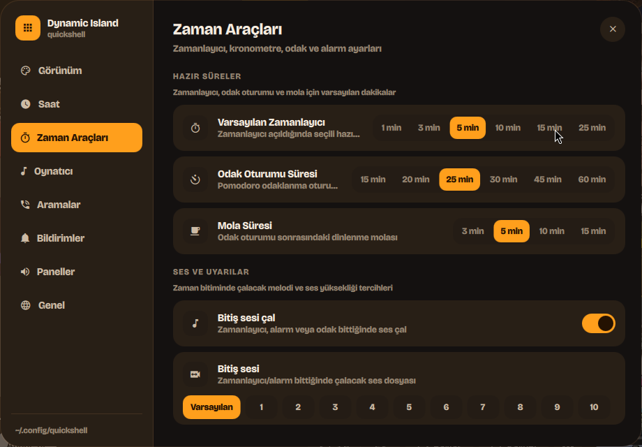
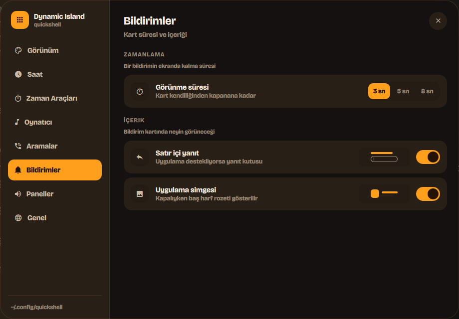

<div align="center">



# Dynamic Island for Quickshell

A configurable Dynamic Island desktop widget for Hyprland and Quickshell — an
MPRIS media player with a CAVA audio visualizer, notifications, privacy
indicators, themes and a pixel-art clock in one adaptive overlay.

[](https://lunanoir21.github.io/quickshell-dynamic-island/changelog.html)
[](https://quickshell.outfoxxed.me/)
[](https://hyprland.org/)
[](LICENSE)

**[Website](https://lunanoir21.github.io/quickshell-dynamic-island/)** · [Türkçe README](README.tr.md)


</div>

---

## Tour

<div align="center">

<video src="https://github.com/lunanoir21/quickshell-dynamic-island/raw/main/docs/demo.mp4" controls muted playsinline width="720" poster="https://raw.githubusercontent.com/lunanoir21/quickshell-dynamic-island/main/docs/cover.png">
</video>

Every surface in order — the pill, the panel, the clock, the four time tools, a
notification, an incoming call, the device indicators and the settings window
changing theme. [Watch it on the site →](https://lunanoir21.github.io/quickshell-dynamic-island/#tour)

</div>

---

## What it is

A single always-on-top surface pinned to the top edge of the screen. Collapsed
it is a compact pill; hover it—or disable hover and click it—and it morphs into a full panel with transport
controls, a spectrum analyser and vertical meters for volume, brightness and
microphone gain. Notifications and microphone/camera activity take the surface
over on their own and hand it back when they are done.

Everything is drawn in greyscale. There is no accent colour anywhere.

<table>
<tr>
<td width="50%"><br><sub><b>Collapsed</b> — cover, title, pixel clock, battery, mic/camera indicators, spectrum ribbon</sub></td>
<td width="50%"><br><sub><b>Media</b> — cover, seek, transport, mirrored spectrum, meters</sub></td>
</tr>
<tr>
<td><br><sub><b>Lyrics</b> — time-synced lines in place of the spectrum, current line lit</sub></td>
<td><br><sub><b>Clock</b> — the same 5×7 font, in English or Turkish</sub></td>
</tr>
<tr>
<td><br><sub><b>Call</b> — radar rings and real answer/decline, folds to a bar once connected</sub></td>
<td><br><sub><b>Notification</b> — resolved app icon and a countdown to dismissal</sub></td>
</tr>
<tr>
<td><br><sub><b>Reply</b> — a field and send button for notifications that support it</sub></td>
<td><br><sub><b>Privacy</b> — raised whenever the mic or camera starts or stops</sub></td>
</tr>
<tr>
<td><br><sub><b>Time</b> — timer, stopwatch, focus and alarm on one stage, with the rail below still reporting the other three</sub></td>
<td><br><sub><b>Time's up</b> — the island changes shape to say so, and answers to Esc, Space or a click</sub></td>
</tr>
</table>

## What changed

**Settings that move, and three themes that are not grey** — the settings
window was legible but static, cutting to every new state. It now animates
what it's doing — the selection slides, switches slide, sections fade in —
and finally follows the theme it's used to pick. Gold, Amber and Red join the
four neutrals.

<table>
<tr>
<td colspan="2"><br><sub><b>Seven themes, shown as themes</b> — each card draws a shrunken island in that theme's own colours, and the window around it wears the theme too</sub></td>
</tr>
<tr>
<td width="50%"><br><sub><b>Eleven chimes, all reachable</b> — the picker used to run off the edge past the seventh sound; picking one now plays it</sub></td>
<td width="50%"><br><sub><b>Switches that slide</b> — position and fill say on or off, and the duration picker slides one highlight</sub></td>
</tr>
</table>

[Full changelog →](https://lunanoir21.github.io/quickshell-dynamic-island/changelog.html)

## Features

- **MPRIS media** — cover art, title/artist, scrubbing, shuffle and repeat,
  previous/play/next. Transport buttons apply optimistically so the UI reacts on
  click instead of waiting for the next poll.
- **Real spectrum analyser** — driven by [`cava`](https://github.com/karlstav/cava),
  mirrored around the centre so the low bands meet in the middle. It spans the
  collapsed pill too; Live maps cava frame-for-frame, while Wave and Calm offer
  shaped variants and a synthetic fallback when cava is unavailable.
- **Settings and themes** — a full settings surface for Black, Umbra, Gray and
  White themes, clock styles, notification/call behaviour, media features,
  language, hover behaviour and animation visibility. Every picker previews the
  thing it changes.
- **Click-to-open mini player** — turn hover opening off and the collapsed island
  can reduce itself to cover, title and previous/play/next. Clicking empty pill
  space opens the full player; both behaviours are independently configurable.
- **Resilient YouTube artwork** — recognises Watch, Music, Shorts, Live, Embed and
  `youtu.be` links, tries thumbnail qualities high-to-low, rejects tiny placeholder
  images and serves the validated result from a local cache.
- **Synced lyrics** — MPRIS has a lyrics field, but essentially nothing fills it
  in (Spotify reports it as an empty string), so lines come from
  [LRCLIB](https://lrclib.net) instead, no account or key needed. Fetched once
  per track and cached on disk, misses included, so a track without lyrics is
  never looked up again on every play — and never on the poll path, so the
  snapshot loop stays network-free.
- **Incoming calls** — recognised from the notification's own accept/decline
  actions, so answering or declining invokes those same D-Bus actions rather
  than faking input at the sending app. Whether a call is actually *live* is
  inferred from PipeWire instead: an app holding a playback and a capture
  stream open at once is, by construction, mid-call, which is what makes the
  timer honest and also covers a call answered on another device.
- **Inline reply** — notifications carrying a KDE-style `inline-reply` action
  get a text field and a send button, wired to the real
  `NotificationReplied` D-Bus signal.
- **Per-app volume mixer** — every PipeWire playback stream, grouped by
  application so a browser with several tabs open is one row, not one per
  stream. Drag to set volume or tap to mute, both applied to every stream that
  app owns.
- **Up next** — a queue panel for players that expose MPRIS's optional
  TrackList interface. Degrades to "not supported" rather than staying
  mysteriously empty for the (most) players that don't.
- **English and Turkish** — switchable from a chip in the panel or over IPC,
  and remembered across restarts. Every string lives in one file, so a third
  language is a matter of adding one branch per line there, not hunting
  through the UI for literals.
- **Pixel-art clock** — a 5×7 bitmap font rendered to a canvas over a dormant LED
  grid. Digits roll vertically one pixel row at a time when they change. Turkish
  Ç/Ğ/İ/Ö/Ş/Ü are included, and the day/month names follow whichever of the two
  languages is active.
- **Time tools** — a timer, a stopwatch with laps, a focus/break cycle and an
  alarm, as one instrument that retunes rather than four widgets splitting the
  width. The readout uses the same 5×7 matrix as the clock, so its digits roll
  the same way, and progress is drawn as a strip of the same square cells rather
  than a bar parked underneath. The rail along the bottom keeps the three modes
  that aren't on stage visible with their live values, so promoting one hides
  nothing. Countdowns tick per second; the stopwatch is elapsed-time based,
  because it is the one readout showing hundredths, where drift would show.
- **Finishing is an event** — when a timer, focus phase or alarm completes, the
  island changes shape into a card that pulses until it is answered, with a
  chime (`pw-play`/`paplay`/`aplay`, or the freedesktop theme). It is dismissed
  by Esc, Space, Return, a click anywhere on it, or its button — but not by the
  pointer that happened to be resting where it appeared, and not by the island
  collapsing, since a timer that finished while nobody was watching has not been
  acknowledged. Under a fullscreen window, where the island cannot draw at all,
  it falls back to the notification daemon and still chimes.
- **Still visible while closed** — a running timer, stopwatch or focus phase, or
  an alarm within ten minutes, keeps a capsule on the collapsed pill: mode icon,
  live value in the pixel matrix, a drain line, and a sweep of light that
  travels across it. Inside the last minute the capsule turns amber and the
  sweep more than doubles its pace, so the pill escalates on its own without
  ever growing or moving.
- **Live device indicators** — PipeWire microphone and V4L2 camera use raise a
  card the moment either starts or stops. These are privacy indicators, so they
  keep polling at a reasonable rate even while the island is collapsed.
- **Notifications** — an app can push a card through IPC, with its own icon —
  preferring the sender's actual image over its generic app icon, which is the
  difference between a browser notification showing the site's favicon or the
  browser's — or a freedesktop icon-name lookup. A copy button on the card
  grabs the message body straight to the clipboard via `wl-copy`.
- **Meters** — volume, brightness and microphone gain as draggable segment bars
  (`wpctl` / `brightnessctl`).
- **Battery** — level, charge state and time-to-empty from sysfs and UPower. The
  level reading is colour-coded (green ≥50%, yellow 20–49%, red <20%), charging
  gets a slow breathing pulse, and a critical card pops up on the crossing into
  red while unplugged.
- **Gets out of the way** — hides completely when the focused window goes
  fullscreen, and comes back when it leaves.

## Requirements

| | |
| --- | --- |
| **Required** | [Quickshell](https://quickshell.outfoxxed.me/) 0.3+, Hyprland (or another wlroots compositor with layer-shell), `jq`, a Nerd Font |
| **Optional** | `playerctl` (media), `wpctl` + `pactl` (audio, mic detection, call detection), `brightnessctl`, `cava` (spectrum), `bluetoothctl`, `upower`, `curl` (lyrics, and quality-checked cached thumbnails for browser tabs), `fuser` (camera detection), `pw-play`/`paplay`/`aplay` or `canberra-gtk-play` (timer chime) |

Anything missing simply leaves its section empty or falls back — nothing hard-fails.

The UI uses **Iosevka Nerd Font** for glyphs by default. Point
`iconFont` in `DynamicIsland.qml` at whichever patched font you have installed.
The text typeface (Bricolage Grotesque) is bundled, so nothing to install there.

## Install

```bash
git clone https://github.com/lunanoir21/quickshell-dynamic-island.git
cd quickshell-dynamic-island
chmod +x backend.sh
quickshell -p ./Main.qml
```

That runs it standalone. To fold it into an existing Quickshell config, drop the
directory in next to your shell root and instantiate the host:

```qml
// Shell.qml
import "dynamic-island" as DynamicIslandModule

ShellRoot {
    DynamicIslandModule.DynamicIslandHost {}
}
```

`DynamicIslandHost` is a `Variants` over `Quickshell.screens`, so it puts one
island on every monitor.

Bind the toggle in `hyprland.conf`:

```ini
bind = SUPER, Super_L, exec, qs -p ~/.config/quickshell/Shell.qml ipc call dynamicIsland toggle
```

## Usage

### Pointer

| Action | Result |
| --- | --- |
| Hover | Expands when **Open on hover** is enabled |
| Leave | Collapses after 90 ms in hover mode |
| Left click on empty pill space | Opens/closes when hover mode is disabled |
| Mini transport buttons | Previous / play-pause / next without expanding |
| Right click | Dismiss |
| Pin chip | Latches it open |

In the default hover mode, left click on empty space remains inert. When hover
opening is disabled, that same space becomes the deliberate expand/collapse
target and the optional mini player keeps transport available while collapsed.

### Keyboard

Available while the island is pinned open.

| Key | Result |
| --- | --- |
| <kbd>Space</kbd> | Play / pause |
| <kbd>←</kbd> <kbd>→</kbd> | Previous / next track |
| <kbd>Esc</kbd> | Close |

The surface takes keyboard focus **only while pinned**. An exclusive layer-shell
grab swallows every keystroke aimed at whatever you are actually typing in, so
tying it to hover would eat your input whenever the pointer happened to rest at
the top of the screen.

### IPC

```bash
qs -p <shell.qml> ipc call dynamicIsland toggle
qs -p <shell.qml> ipc call dynamicIsland open
qs -p <shell.qml> ipc call dynamicIsland close
qs -p <shell.qml> ipc call dynamicIsland activity "any text"
qs -p <shell.qml> ipc call dynamicIsland notify <app> <title> <body> <icon>
qs -p <shell.qml> ipc call dynamicIsland notifyWithActions <app> <title> <body> <icon> <actionsJson> <uid> <hasInlineReply> <inlineReplyPlaceholder>
qs -p <shell.qml> ipc call dynamicIsland deviceEvent <microphone|camera> <true|false> <value>
qs -p <shell.qml> ipc call dynamicIsland battery <level> <Charging|Discharging>
qs -p <shell.qml> ipc call dynamicIsland batteryReset
qs -p <shell.qml> ipc call dynamicIsland batteryAlert <level>
qs -p <shell.qml> ipc call dynamicIsland timeMode <timer|stopwatch|focus|alarm>
qs -p <shell.qml> ipc call dynamicIsland timeToggle
qs -p <shell.qml> ipc call dynamicIsland timeReset
qs -p <shell.qml> ipc call dynamicIsland timerTest
qs -p <shell.qml> ipc call dynamicIsland timerDismiss
qs -p <shell.qml> ipc call dynamicIsland lyrics
qs -p <shell.qml> ipc call dynamicIsland language <tr|en|toggle>
qs -p <shell.qml> ipc call dynamicIsland hover <true|false>
qs -p <shell.qml> ipc call dynamicIsland compactControls <true|false>
qs -p <shell.qml> ipc call dynamicIsland dismissCall
```

Wire `notify` into your notification daemon to route plain notifications
through the island. Calls and inline reply need `notifyWithActions` instead,
and a bit of wiring on the daemon side; see the next section — `actionsJson`
in particular is not something to hand-construct on a command line.

`dismissCall` ends an incoming-call screen without answering or declining it —
a call rings on its own timer independent of the sending notification's
`expire_timeout`, so this is the only way to back one out early, including one
raised by mistake.

`battery` stands in for the real sysfs/UPower reading for a few seconds, so
the level colour (green ≥50%, yellow 20–49%, red <20%) and the charging pulse
can be exercised on demand; `batteryReset` drops the override early instead of
waiting out its ~8s expiry. `batteryAlert` fires the critical-battery card
directly, independent of the real or overridden level.

`timeMode` opens the time page straight onto one instrument, so a keybind can
land on the stopwatch rather than wherever the page was left. `timeToggle` and
`timeReset` drive whichever mode is on the stage without opening the island at
all — enough to bind start/pause to a key. `timerTest` raises the completion
card on demand, and `timerDismiss` clears it.

### Testing widgets

The bundled `Makefile` wraps the IPC calls above (and a few more) into
one-off shortcuts, so any single widget can be exercised without waiting for
the real hardware or app state to produce it:

```bash
make mic-on              # mic capsule lights up, green
make camera-off
make battery-animation   # 55%, charging — see the breathing pulse
make battery-low         # 12%, discharging — red
make battery-alert       # critical-battery card, independent of the level above
make timer               # open the time page on the timer
make time-toggle         # start/pause whichever mode is on the stage
make timer-done          # fire the completion card — chime included
make call                # incoming-call ring
make notification
make theme-cycle
make help                # full list
```

It targets whatever `Shell.qml` your `SUPER` keybind points at by default;
override with `make SHELL_QML=/path/to/Shell.qml <target>` if your checkout
lives somewhere else. The island has to actually be running for any of this
to do anything.

### Calls and inline reply

Both ride on the same extra IPC function:

```
notifyWithActions(app, title, body, icon, actionsJson, uid, hasInlineReply, inlineReplyPlaceholder)
```

`actionsJson` is `base64(JSON.stringify([{id, text}, ...]))` — **not** raw
JSON. `quickshell ipc call` expands any bare `[...]`-shaped argument by
splitting it on top-level commas, which silently miscounts the argument list
for anything with two or more actions (and reads `"[]"` itself as zero
arguments). Base64 never starts with `[`, so it never triggers that.

The island recognises an incoming call from the notification's own
accept/decline actions and answers or declines through those same actions —
it never fakes input at the sending app. That means `notifyWithActions` has
to be fed real actions and a real per-notification `uid` from an actual
`NotificationServer`, which is more than `backend.sh` alone can produce: this
project is the island itself, not a notification daemon, so that server has
to live in whatever Quickshell config hosts the island. A minimal one looks
like this:

```qml
// Shell.qml (or wherever your shell's Main.qml lives)
import Quickshell.Services.Notifications

NotificationServer {
    id: notifications
    actionsSupported: true
    imageSupported: true
    inlineReplySupported: true   // required for hasInlineReply to ever be true

    property var live: ({})
    property int counter: 0

    onNotification: (n) => {
        n.tracked = true
        counter++
        live[counter] = n

        let actions = []
        if (n.actions) {
            for (let i = 0; i < n.actions.length; i++)
                actions.push({ id: n.actions[i].identifier, text: n.actions[i].text })
        }

        Quickshell.execDetached(["quickshell", "-p", "<shell.qml>",
            "ipc", "call", "dynamicIsland", "notifyWithActions",
            n.appName, n.summary, n.body,
            n.image !== "" ? n.image : n.appIcon,   // prefer the real image over the app icon
            Qt.btoa(JSON.stringify(actions)), String(counter),
            n.hasInlineReply ? "true" : "false", n.inlineReplyPlaceholder])
    }
}

// A second IPC target the island calls back into when a call is answered,
// declined, or replied to.
IpcHandler {
    target: "notificationBridge"

    function invokeAction(uid: string, actionId: string): void {
        let n = notifications.live[uid]
        if (!n || !n.actions) return
        for (let i = 0; i < n.actions.length; i++) {
            if (n.actions[i].identifier === actionId) { n.actions[i].invoke(); break }
        }
    }

    function sendInlineReply(uid: string, text: string): void {
        let n = notifications.live[uid]
        if (n && n.hasInlineReply) n.sendInlineReply(text)
    }
}
```

The island calls `notificationBridge` back over IPC at the same `-p` path it
was given for its *own* target, so both handlers need to be reachable from
that one path — they do not have to live in the same file, only the same
running Quickshell instance.

### Language

English and Turkish, switchable at runtime — click the `TR`/`EN` chip in the
open panel, or use the `language` IPC call above. The choice is written to
`$XDG_CONFIG_HOME/quickshell/dynamic-island/language` and restored on startup.

Without a saved choice the island follows `QS_ISLAND_LANG`, then the session
locale (`LC_ALL` / `LC_MESSAGES` / `LANG`), falling back to English. Every
string lives in `Strings.qml`; adding a language means adding one branch per
line there.

### Lyrics

The lyrics chip (`󰨖`) in the open panel swaps the visualiser for time-synced
lyrics, highlighting the current line and showing the ones either side of it.

MPRIS has a lyrics field, but essentially nothing fills it in — Spotify reports
it as an empty string — so lines come from [LRCLIB](https://lrclib.net), which
needs no account or API key. They are fetched once per track and cached under
`$XDG_CACHE_HOME/quickshell/dynamic-island/lyrics/`; tracks with no lyrics are
remembered too, so a miss is not re-requested on every play. Nothing is fetched
on the snapshot path, so the poll loop never touches the network.

Tracks that only have untimed lyrics still show them, labelled as not synced
rather than pretending to follow along.

## How it works

```
Main.qml                 ShellRoot entry point
└── DynamicIslandHost    Variants over Quickshell.screens — one island per monitor
    └── DynamicIsland    The surface: state machine, layout, every animation
        ├── Strings      Every user-visible string, in English and Turkish
        ├── SettingsMenu Full settings surface: themes, clock, notifications/calls, language
        ├── BarMeter     Draggable segment meter (volume / brightness / mic)
        ├── AppVolumeRow One row of the per-app mixer (name, mute, drag-to-set volume)
        ├── PixelClock   Composes the pixel time, seconds and date line
        │   └── PixelText  Canvas bitmap-text renderer with vertical digit rolls
        │       └── pixelfont.js  5×7 glyph table + per-language day/month names
        └── backend.sh   One JSON snapshot per poll, plus on-demand lyrics fetches
```

Calls and inline reply are the exception to "everything is in this directory":
they need a real `NotificationServer` and a `notificationBridge` IpcHandler
supplying `notifyWithActions`, which live in whatever Quickshell config hosts
the island, not in `backend.sh`. See
[Calls and inline reply](#calls-and-inline-reply) above.

`backend.sh snapshot` emits the entire UI state as one JSON object. Costly work
(bluetooth, UPower, camera detection) is refreshed in a locked
background job and read from cache, so a poll never blocks on it. Playback
position is interpolated locally between polls and resynced when it drifts, so
the progress bar moves smoothly rather than stepping.

### Two conventions worth knowing before you edit

**Looping animations never bind directly to a visual property.** Each one drives
a resettable number (`playGlow`, `ringPulse`, `visualPhase`, `edgeGlow`) and
returns it to a known resting value when it stops. Writing
`SequentialAnimation on opacity { loops: Infinite }` freezes the property
wherever the loop happened to be when its condition went false, which leaves
half-faded rings and stalled bars on screen.

**`Behavior` is only for smoothing discrete input.** It smooths cava's 30 Hz
samples. Putting one on a value that already changes every frame just retargets
the animation before it can go anywhere, which flattens the spectrum into a
motionless row of stubs.

## Credits

- [Quickshell](https://quickshell.outfoxxed.me/) by outfoxxed
- Behaviours adapted from [`boring.notch`](https://github.com/TheBoredTeam/boring.notch)
- [Bricolage Grotesque](https://github.com/ateliertriay/bricolage) (OFL 1.1, bundled)
- [cava](https://github.com/karlstav/cava) for the spectrum data
- [LRCLIB](https://lrclib.net) for lyrics

## License

MIT — see [LICENSE](LICENSE). The bundled typeface is OFL 1.1.
