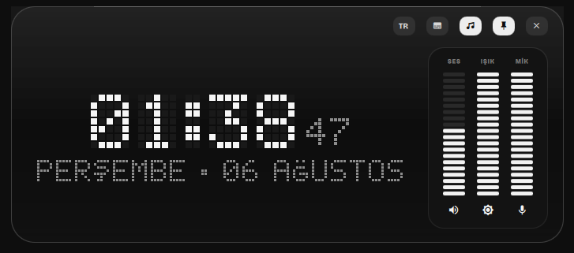
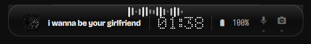
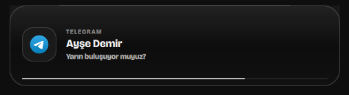
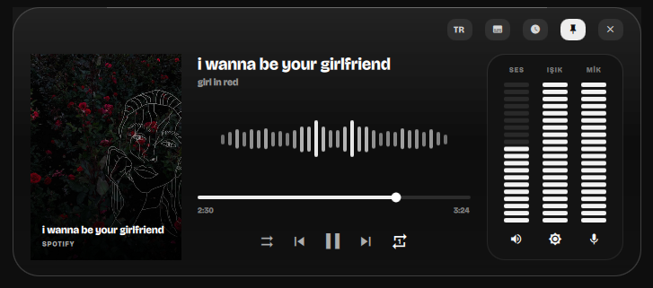
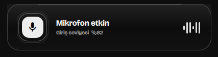

<div align="center">

# Dynamic Island for Quickshell

A monochrome notch-style overlay for Hyprland — media, live device indicators
and a pixel-art clock in one surface that grows under the pointer.

[](https://quickshell.outfoxxed.me/)
[](https://hyprland.org/)
[](LICENSE)

**[Website](https://lunanoir21.github.io/quickshell-dynamic-island/)** · [Türkçe README](README.tr.md)



</div>

---

## What it is

A single always-on-top surface pinned to the top edge of the screen. Collapsed
it is a compact pill; hover it and it morphs into a full panel with transport
controls, a spectrum analyser and vertical meters for volume, brightness and
microphone gain. Notifications and microphone/camera activity take the surface
over on their own and hand it back when they are done.

Everything is drawn in greyscale. There is no accent colour anywhere.

<table>
<tr>
<td width="50%"><br><sub><b>Collapsed</b> — cover, title, pixel clock, battery, mic/camera indicators, spectrum ribbon</sub></td>
<td width="50%"><br><sub><b>Notification</b> — resolved app icon and a countdown to dismissal</sub></td>
</tr>
<tr>
<td><br><sub><b>Media</b> — cover, seek, transport, mirrored spectrum, meters</sub></td>
<td><br><sub><b>Privacy</b> — raised whenever the mic or camera starts or stops</sub></td>
</tr>
</table>

## Features

- **MPRIS media** — cover art, title/artist, scrubbing, shuffle and repeat,
  previous/play/next. Transport buttons apply optimistically so the UI reacts on
  click instead of waiting for the next poll.
- **Real spectrum analyser** — driven by [`cava`](https://github.com/karlstav/cava),
  mirrored around the centre so the low bands meet in the middle. Falls back to a
  synthetic curve when cava is unavailable or the panel is closed.
- **Pixel-art clock** — a 5×7 bitmap font rendered to a canvas over a dormant LED
  grid. Digits roll vertically one pixel row at a time when they change. Turkish
  Ç/Ğ/İ/Ö/Ş/Ü are included.
- **Live device indicators** — PipeWire microphone and V4L2 camera use raise a
  card the moment either starts or stops. These are privacy indicators, so they
  keep polling at a reasonable rate even while the island is collapsed.
- **Notifications** — an app can push a card through IPC, with its own icon or a
  freedesktop icon-name lookup.
- **Meters** — volume, brightness and microphone gain as draggable segment bars
  (`wpctl` / `brightnessctl`).
- **Weather and battery** — Open-Meteo with IP geolocation, cached for 15 minutes;
  battery level, charge state and time-to-empty from sysfs and UPower.
- **Gets out of the way** — hides completely when the focused window goes
  fullscreen, and comes back when it leaves.

## Requirements

| | |
| --- | --- |
| **Required** | [Quickshell](https://quickshell.outfoxxed.me/) 0.3+, Hyprland (or another wlroots compositor with layer-shell), `jq`, a Nerd Font |
| **Optional** | `playerctl` (media), `wpctl` + `pactl` (audio, mic detection), `brightnessctl`, `cava` (spectrum), `bluetoothctl`, `upower`, `curl` (weather), `fuser` (camera detection) |

Anything missing simply leaves its section empty or falls back — nothing hard-fails.

The UI uses **Iosevka Nerd Font** for glyphs by default. Point
`iconFont` in `DynamicIsland.qml` at whichever patched font you have installed.
The text typeface (Bricolage Grotesque) is bundled, so nothing to install there.

## Install

```bash
git clone https://github.com/lunanoir21/quickshell-dynamic-island.git
cd quickshell-dynamic-island
chmod +x backend.sh
quickshell -p ./Main.qml
```

That runs it standalone. To fold it into an existing Quickshell config, drop the
directory in next to your shell root and instantiate the host:

```qml
// Shell.qml
import "dynamic-island" as DynamicIslandModule

ShellRoot {
    DynamicIslandModule.DynamicIslandHost {}
}
```

`DynamicIslandHost` is a `Variants` over `Quickshell.screens`, so it puts one
island on every monitor.

Bind the toggle in `hyprland.conf`:

```ini
bind = SUPER, Super_L, exec, qs -p ~/.config/quickshell/Shell.qml ipc call dynamicIsland toggle
```

## Usage

### Pointer

| Action | Result |
| --- | --- |
| Hover | Expands |
| Leave | Collapses after 90 ms |
| Right click | Dismiss |
| Pin chip | Latches it open |

Left click is deliberately inert. Leaving the island is meant to close it, so an
accidental click on empty panel space must never be able to latch it open.

### Keyboard

Available while the island is pinned open.

| Key | Result |
| --- | --- |
| <kbd>Space</kbd> | Play / pause |
| <kbd>←</kbd> <kbd>→</kbd> | Previous / next track |
| <kbd>Esc</kbd> | Close |

The surface takes keyboard focus **only while pinned**. An exclusive layer-shell
grab swallows every keystroke aimed at whatever you are actually typing in, so
tying it to hover would eat your input whenever the pointer happened to rest at
the top of the screen.

### IPC

```bash
qs -p <shell.qml> ipc call dynamicIsland toggle
qs -p <shell.qml> ipc call dynamicIsland open
qs -p <shell.qml> ipc call dynamicIsland close
qs -p <shell.qml> ipc call dynamicIsland activity "any text"
qs -p <shell.qml> ipc call dynamicIsland notify <app> <title> <body> <icon>
qs -p <shell.qml> ipc call dynamicIsland deviceEvent <microphone|camera> <true|false> <value>
qs -p <shell.qml> ipc call dynamicIsland lyrics
qs -p <shell.qml> ipc call dynamicIsland language <tr|en|toggle>
```

Wire `notify` into your notification daemon to route notifications through the
island.

### Language

English and Turkish, switchable at runtime — click the `TR`/`EN` chip in the
open panel, or use the `language` IPC call above. The choice is written to
`$XDG_CONFIG_HOME/quickshell/dynamic-island/language` and restored on startup.

Without a saved choice the island follows `QS_ISLAND_LANG`, then the session
locale (`LC_ALL` / `LC_MESSAGES` / `LANG`), falling back to English. Every
string lives in `Strings.qml`; adding a language means adding one branch per
line there.

### Lyrics

The lyrics chip (`󰨖`) in the open panel swaps the visualiser for time-synced
lyrics, highlighting the current line and showing the ones either side of it.

MPRIS has a lyrics field, but essentially nothing fills it in — Spotify reports
it as an empty string — so lines come from [LRCLIB](https://lrclib.net), which
needs no account or API key. They are fetched once per track and cached under
`$XDG_CACHE_HOME/quickshell/dynamic-island/lyrics/`; tracks with no lyrics are
remembered too, so a miss is not re-requested on every play. Nothing is fetched
on the snapshot path, so the poll loop never touches the network.

Tracks that only have untimed lyrics still show them, labelled as not synced
rather than pretending to follow along.

## How it works

```
Main.qml                 ShellRoot entry point
└── DynamicIslandHost    Variants over Quickshell.screens — one island per monitor
    └── DynamicIsland    The surface: state machine, layout, every animation
        ├── BarMeter     Draggable segment meter (volume / brightness / mic)
        ├── PixelClock   Composes the pixel time, seconds and date line
        │   └── PixelText  Canvas bitmap-text renderer with vertical digit rolls
        │       └── pixelfont.js  5×7 glyph table + Turkish day/month names
        └── backend.sh   One JSON snapshot per poll
```

`backend.sh snapshot` emits the entire UI state as one JSON object. Costly work
(weather, bluetooth, UPower, camera detection) is refreshed in a locked
background job and read from cache, so a poll never blocks on it. Playback
position is interpolated locally between polls and resynced when it drifts, so
the progress bar moves smoothly rather than stepping.

### Two conventions worth knowing before you edit

**Looping animations never bind directly to a visual property.** Each one drives
a resettable number (`playGlow`, `ringPulse`, `visualPhase`, `edgeGlow`) and
returns it to a known resting value when it stops. Writing
`SequentialAnimation on opacity { loops: Infinite }` freezes the property
wherever the loop happened to be when its condition went false, which leaves
half-faded rings and stalled bars on screen.

**`Behavior` is only for smoothing discrete input.** It smooths cava's 30 Hz
samples. Putting one on a value that already changes every frame just retargets
the animation before it can go anywhere, which flattens the spectrum into a
motionless row of stubs.

## Localisation

Interface strings are Turkish and live inline in `DynamicIsland.qml`. The pixel
font in `pixelfont.js` carries Turkish day and month names. Both are
straightforward to swap.

## Credits

- [Quickshell](https://quickshell.outfoxxed.me/) by outfoxxed
- Behaviours adapted from [`boring.notch`](https://github.com/TheBoredTeam/boring.notch)
- [Bricolage Grotesque](https://github.com/ateliertriay/bricolage) (OFL 1.1, bundled)
- [cava](https://github.com/karlstav/cava) for the spectrum data

## License

MIT — see [LICENSE](LICENSE). The bundled typeface is OFL 1.1.
