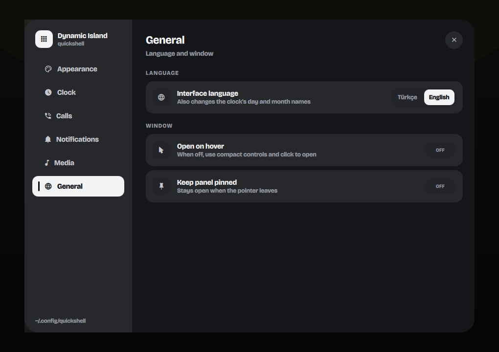
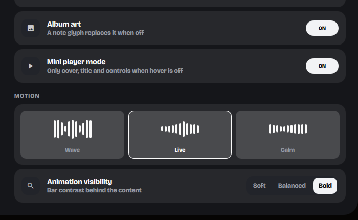
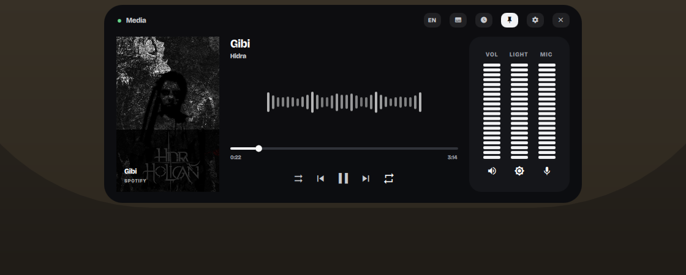

<div align="center">

# Quickshell için Dynamic Island

Hyprland ve Quickshell için ayarlanabilir bir Dynamic Island masaüstü widget'ı —
MPRIS medya oynatıcı, CAVA ses görselleştirici, bildirimler, gizlilik
göstergeleri, temalar ve pixel-art saat; uyarlanabilir tek bir katmanda.

[](https://quickshell.outfoxxed.me/)
[](https://hyprland.org/)
[](LICENSE)

**[Web sitesi](https://lunanoir21.github.io/quickshell-dynamic-island/)** · [English README](README.md)


</div>

---

## Nedir

Ekranın üst kenarına sabitlenmiş, her zaman üstte duran tek bir yüzey. Kapalıyken
kompakt bir pill; üzerine gelerek—ya da hover'ı kapatıp tıklayarak—aktarım kontrolleri, spektrum
analizörü ve ses/parlaklık/mikrofon için dikey ölçerler içeren tam bir panele
dönüşür. Bildirimler ile mikrofon/kamera etkinliği yüzeyi kendiliğinden devralır
ve işleri bitince geri verir.

Her şey gri tonlamada çizilir. Hiçbir yerde vurgu rengi yoktur.

<table>
<tr>
<td width="50%"><br><sub><b>Kapalı</b> — kapak, başlık, pixel saat, pil, mikrofon/kamera göstergeleri, spektrum şeridi</sub></td>
<td width="50%"><br><sub><b>Medya</b> — kapak, seek, aktarım, aynalanmış spektrum, ölçerler</sub></td>
</tr>
<tr>
<td><br><sub><b>Sözler</b> — spektrum yerine zamanla senkronize satırlar, o an çalan vurgulu</sub></td>
<td><br><sub><b>Saat</b> — aynı 5×7 font, İngilizce veya Türkçe</sub></td>
</tr>
<tr>
<td><br><sub><b>Arama</b> — radar halkaları ve gerçek kabul/reddet, bağlanınca bara küçülür</sub></td>
<td><br><sub><b>Bildirim</b> — çözümlenmiş uygulama simgesi ve kapanma geri sayımı</sub></td>
</tr>
<tr>
<td><br><sub><b>Yanıt</b> — destekleyen bildirimler için metin kutusu ve gönder düğmesi</sub></td>
<td><br><sub><b>Gizlilik</b> — mikrofon veya kamera her açılıp kapandığında belirir</sub></td>
</tr>
</table>

## Neler değişti

<table>
<tr>
<td width="50%"><br><sub><b>Mini oynatıcı</b> — canlı ses alanı üzerinde kapak, başlık, önceki/oynat/sonraki ve kalan süre çizgisi</sub></td>
<td width="50%"><br><sub><b>Etkileşimi seç</b> — hover ile aç veya kapalı tutup tam panel gerektiğinde tıkla</sub></td>
</tr>
<tr>
<td><br><sub><b>Ayarlanabilir hareket</b> — Dalga, Canlı ve Sakin; ayrıca Hafif/Dengeli/Belirgin görünürlük</sub></td>
<td><br><sub><b>Kararlı temalar</b> — Siyah, Umbra, Gri ve Beyaz artık kontrastı koruyarak oynatıcıya da uygulanıyor</sub></td>
</tr>
</table>

## Özellikler

- **MPRIS medya** — kapak görseli, başlık/sanatçı, seek, shuffle ve repeat,
  önceki/oynat/sonraki. Aktarım düğmeleri iyimser davranır: bir sonraki poll'ü
  beklemek yerine tıklama anında tepki verir.
- **Gerçek spektrum analizörü** — [`cava`](https://github.com/karlstav/cava) ile
  beslenir, bas bantlar ortada buluşacak şekilde aynalanır ve kapalı pill'in
  tamamına yayılır. Canlı, cava'yı kare kare izler; Dalga ve Sakin biçimlendirilmiş
  varyantlar sunar, cava yoksa sentetik yedeğe düşer.
- **Ayarlar ve temalar** — Siyah, Umbra, Gri ve Beyaz temalar; saat stilleri,
  bildirim/arama davranışı, medya özellikleri, dil, hover davranışı ve animasyon
  belirginliği için tam bir ayar yüzeyi. Seçiciler değiştirdikleri şeyi canlı gösterir.
- **Tıklayarak açılan mini oynatıcı** — hover ile açmayı kapattığınızda ada yalnız
  kapak, başlık ve önceki/oynat/sonraki kontrollerine küçülebilir. Boş pill alanına
  tıklamak tam oynatıcıyı açar; iki davranış da ayrı ayrı ayarlanabilir.
- **Dayanıklı YouTube kapakları** — Watch, Music, Shorts, Live, Embed ve `youtu.be`
  bağlantılarını tanır; kalite seçeneklerini yüksekten düşüğe dener, küçük yer tutucu
  görselleri reddeder ve doğrulanan sonucu yerel önbellekten sunar.
- **Senkronize şarkı sözleri** — MPRIS'in bir sözler alanı var ama neredeyse
  hiçbir oynatıcı doldurmuyor (Spotify boş dize döndürüyor), bu yüzden satırlar
  hesap ya da anahtar istemeyen [LRCLIB](https://lrclib.net)'den geliyor. Parça
  başına bir kez indirilip diske önbelleğe alınıyor, sözü olmayanlar da dahil —
  böylece bir parça her çalışta yeniden sorgulanmıyor, ve hiçbiri yoklama
  (snapshot) yolunda olmadığı için döngü ağa hiç dokunmuyor.
- **Gelen aramalar** — bildirimin kendi kabul/reddet aksiyonlarından tanınır;
  cevaplamak ya da reddetmek, gönderen uygulamada sahte girdi üretmek yerine
  doğrudan o D-Bus aksiyonlarını çağırır. Bir aramanın gerçekten *canlı* olup
  olmadığı ise PipeWire'dan çıkarılır: aynı anda bir çalma ve bir kayıt akışı
  tutan uygulama, tanım itibarıyla aramadadır — bu da süre sayacını doğru
  tutar ve başka bir cihazdan cevaplanan aramayı da kapsar.
- **Satır içi yanıt** — KDE tarzı bir `inline-reply` aksiyonu taşıyan bildirimler
  bir metin kutusu ve gönder düğmesi alır; gerçek `NotificationReplied` D-Bus
  sinyaline bağlıdır.
- **İngilizce ve Türkçe** — panelde bir çip veya IPC ile değiştirilebilir, ve
  yeniden başlatmalar arasında hatırlanır. Her metin tek bir dosyada; üçüncü
  bir dil eklemek arayüzde sabit metin aramak değil, oradaki her satıra bir
  dal eklemek demektir.
- **Pixel-art saat** — dormant bir LED ızgarası üzerine canvas ile çizilen 5×7
  bitmap yazı tipi. Rakamlar değişince satır satır dikey olarak yuvarlanır.
  Türkçe Ç/Ğ/İ/Ö/Ş/Ü dahildir, gün/ay adları da aktif dile göre değişir.
- **Canlı cihaz göstergeleri** — PipeWire mikrofonu ve V4L2 kamerası her
  başladığında/durduğunda bir kart yükseltir. Bunlar gizlilik göstergeleri
  olduğu için ada kapalıyken bile makul bir hızda yoklanır.
- **Bildirimler** — bir uygulama IPC üzerinden kart gönderebilir; kendi
  simgesiyle — gönderenin gerçek görselini genel uygulama simgesi yerine
  öncelikli tutar, bu da bir tarayıcı bildiriminin sitenin favicon'unu mu
  yoksa tarayıcının kendi simgesini mi göstereceğinin farkıdır — ya da
  freedesktop simge adı çözümlemesiyle.
- **Ölçerler** — ses, parlaklık ve mikrofon kazancı sürüklenebilir segment
  çubukları olarak (`wpctl` / `brightnessctl`).
- **Hava durumu ve pil** — IP konumuyla Open-Meteo, 15 dakika önbelleklenir;
  pil seviyesi, şarj durumu ve kalan süre sysfs ile UPower'dan.
- **Yoldan çekilir** — odaktaki pencere tam ekrana geçince tamamen gizlenir,
  çıkınca geri gelir.

## Gereksinimler

| | |
| --- | --- |
| **Zorunlu** | [Quickshell](https://quickshell.outfoxxed.me/) 0.3+, Hyprland (veya layer-shell destekleyen başka bir wlroots bileşik yöneticisi), `jq`, bir Nerd Font |
| **İsteğe bağlı** | `playerctl` (medya), `wpctl` + `pactl` (ses, mikrofon algılama, arama algılama), `brightnessctl`, `cava` (spektrum), `bluetoothctl`, `upower`, `curl` (hava durumu, şarkı sözleri ve tarayıcı sekmeleri için kalite denetimli önbellekli kapak görseli), `fuser` (kamera algılama) |

Eksik olan her şey ilgili bölümü boş bırakır ya da yedeğe düşer — hiçbiri
projeyi çökertmez.

Arayüz simgeler için varsayılan olarak **Iosevka Nerd Font** kullanır.
`DynamicIsland.qml` içindeki `iconFont` değerini kurulu olan yamalı fontunuza
yöneltin. Metin yazı tipi (Bricolage Grotesque) projeye dahildir.

## Kurulum

```bash
git clone https://github.com/lunanoir21/quickshell-dynamic-island.git
cd quickshell-dynamic-island
chmod +x backend.sh
quickshell -p ./Main.qml
```

Bu, projeyi tek başına çalıştırır. Mevcut bir Quickshell yapılandırmasına
katmak için dizini shell kökünüzün yanına koyun ve host'u örnekleyin:

```qml
// Shell.qml
import "dynamic-island" as DynamicIslandModule

ShellRoot {
    DynamicIslandModule.DynamicIslandHost {}
}
```

`DynamicIslandHost`, `Quickshell.screens` üzerinde bir `Variants` olduğu için
her monitöre bir ada yerleştirir.

`hyprland.conf` içine geçiş tuşunu bağlayın:

```ini
bind = SUPER, Super_L, exec, qs -p ~/.config/quickshell/Shell.qml ipc call dynamicIsland toggle
```

## Kullanım

### İmleç

| Eylem | Sonuç |
| --- | --- |
| Üzerine gelme | **Üzerine gelince aç** etkinse açılır |
| Ayrılma | Hover modunda 90 ms içinde kapanır |
| Boş pill alanına sol tık | Hover kapalıyken açar/kapatır |
| Mini aktarım düğmeleri | Genişletmeden önceki / oynat-duraklat / sonraki |
| Sağ tık | Kapatır |
| Raptiye düğmesi | Açık kilitler |

Varsayılan hover modunda boş alana sol tık işlevsiz kalır. Hover ile açma
kapatıldığında aynı alan bilinçli aç/kapat hedefi olur ve isteğe bağlı mini
oynatıcı kapalıyken de aktarım kontrollerini kullanılabilir tutar.

### Klavye

Ada raptiyeliyken çalışır.

| Tuş | Sonuç |
| --- | --- |
| <kbd>Boşluk</kbd> | Oynat / duraklat |
| <kbd>←</kbd> <kbd>→</kbd> | Önceki / sonraki parça |
| <kbd>Esc</kbd> | Kapat |

Yüzey klavye odağını **yalnızca raptiyeliyken** alır. Münhasır bir layer-shell
grab'i, asıl yazdığınız uygulamaya giden her tuşu yutar; bunu hover'a bağlamak
imleç ekranın üstünde durduğu her an girdinizi yer.

### IPC

```bash
qs -p <shell.qml> ipc call dynamicIsland toggle
qs -p <shell.qml> ipc call dynamicIsland open
qs -p <shell.qml> ipc call dynamicIsland close
qs -p <shell.qml> ipc call dynamicIsland activity "herhangi bir metin"
qs -p <shell.qml> ipc call dynamicIsland notify <uygulama> <başlık> <gövde> <simge>
qs -p <shell.qml> ipc call dynamicIsland notifyWithActions <uygulama> <başlık> <gövde> <simge> <actionsJson> <uid> <hasInlineReply> <inlineReplyPlaceholder>
qs -p <shell.qml> ipc call dynamicIsland deviceEvent <microphone|camera> <true|false> <değer>
qs -p <shell.qml> ipc call dynamicIsland lyrics
qs -p <shell.qml> ipc call dynamicIsland language <tr|en|toggle>
qs -p <shell.qml> ipc call dynamicIsland hover <true|false>
qs -p <shell.qml> ipc call dynamicIsland compactControls <true|false>
qs -p <shell.qml> ipc call dynamicIsland dismissCall
```

Düz bildirimleri adaya yönlendirmek için `notify`'ı bildirim sunucunuza bağlayın.
Aramalar ve satır içi yanıt yerine `notifyWithActions` ister, ve sunucu
tarafında biraz bağlantı gerektirir; bir sonraki bölüme bakın — özellikle
`actionsJson` komut satırında elle oluşturulacak bir şey değil.

`dismissCall`, cevaplamadan/reddetmeden gelen arama ekranını kapatır — bir
arama, gönderen bildirimin `expire_timeout`'undan bağımsız olarak kendi
zamanlayıcısında çalar; yanlışlıkla tetiklenmiş biri dahil, erken çıkmanın
tek yolu budur.

### Aramalar ve satır içi yanıt

İkisi de aynı ek IPC fonksiyonuna biner:

```
notifyWithActions(app, title, body, icon, actionsJson, uid, hasInlineReply, inlineReplyPlaceholder)
```

`actionsJson`, `base64(JSON.stringify([{id, text}, ...]))` — **ham JSON değil**.
`quickshell ipc call`, düz bir `[...]` şeklindeki argümanı üst seviye
virgüllerden bölerek genişletir; bu, iki veya daha fazla aksiyonu olan her şey
için argüman listesini sessizce yanlış sayar (ve `"[]"`'nin kendisini sıfır
argüman olarak okur). Base64 asla `[` ile başlamadığı için bunu hiç tetiklemez.

Ada, gelen bir aramayı bildirimin kendi kabul/reddet aksiyonlarından tanır ve
cevaplama/reddetmeyi o aynı aksiyonlar üzerinden yapar — gönderen uygulamada
asla sahte girdi üretmez. Bu da `notifyWithActions`'ın gerçek aksiyonlarla ve
gerçek bir bildirim başına `uid` ile beslenmesi gerektiği anlamına gelir; bu,
`backend.sh`'nin tek başına üretebileceğinden fazlasıdır: bu proje adanın
kendisidir, bir bildirim sunucusu değil — o sunucu, adayı barındıran hangi
Quickshell yapılandırmasıysa onda yaşamalı. Minimal biri şöyle görünür:

```qml
// Shell.qml (veya shell'inizin Main.qml'i her neredeyse)
import Quickshell.Services.Notifications

NotificationServer {
    id: notifications
    actionsSupported: true
    imageSupported: true
    inlineReplySupported: true   // hasInlineReply'nin hiç true olabilmesi için gerekli

    property var live: ({})
    property int counter: 0

    onNotification: (n) => {
        n.tracked = true
        counter++
        live[counter] = n

        let actions = []
        if (n.actions) {
            for (let i = 0; i < n.actions.length; i++)
                actions.push({ id: n.actions[i].identifier, text: n.actions[i].text })
        }

        Quickshell.execDetached(["quickshell", "-p", "<shell.qml>",
            "ipc", "call", "dynamicIsland", "notifyWithActions",
            n.appName, n.summary, n.body,
            n.image !== "" ? n.image : n.appIcon,   // gerçek görseli uygulama simgesine tercih et
            Qt.btoa(JSON.stringify(actions)), String(counter),
            n.hasInlineReply ? "true" : "false", n.inlineReplyPlaceholder])
    }
}

// Bir arama cevaplandığında, reddedildiğinde ya da yanıtlandığında adanın
// geri çağırdığı ikinci bir IPC hedefi.
IpcHandler {
    target: "notificationBridge"

    function invokeAction(uid: string, actionId: string): void {
        let n = notifications.live[uid]
        if (!n || !n.actions) return
        for (let i = 0; i < n.actions.length; i++) {
            if (n.actions[i].identifier === actionId) { n.actions[i].invoke(); break }
        }
    }

    function sendInlineReply(uid: string, text: string): void {
        let n = notifications.live[uid]
        if (n && n.hasInlineReply) n.sendInlineReply(text)
    }
}
```

Ada, `notificationBridge`'i kendi hedefine verilen aynı `-p` yolu üzerinden
geri çağırır; yani iki handler'ın da o tek yoldan erişilebilir olması gerekir
— aynı dosyada yaşamalarına gerek yok, sadece aynı çalışan Quickshell
örneğinde.

### Dil

Türkçe ve İngilizce, çalışma anında değiştirilebilir — açık paneldeki `TR`/`EN`
çipine tıklayın ya da yukarıdaki `language` IPC çağrısını kullanın. Seçim
`$XDG_CONFIG_HOME/quickshell/dynamic-island/language` dosyasına yazılır ve
açılışta geri yüklenir.

Kayıtlı bir seçim yoksa ada sırasıyla `QS_ISLAND_LANG` değişkenine, ardından
oturum yereline (`LC_ALL` / `LC_MESSAGES` / `LANG`) bakar; hiçbiri yoksa
İngilizceye düşer. Tüm metinler `Strings.qml` içinde; yeni bir dil eklemek
oradaki her satıra bir dal eklemek demektir.

### Şarkı sözleri

Açık paneldeki sözler çipi (`󰨖`) görselleştiriciyi zamanla senkronize şarkı
sözleriyle değiştirir; o an çalan satır vurgulanır, bir önceki ve bir sonraki
satır soluk gösterilir.

MPRIS'in bir sözler alanı var ama neredeyse hiçbir oynatıcı doldurmuyor —
Spotify boş dize döndürüyor — bu yüzden satırlar hesap ya da API anahtarı
gerektirmeyen [LRCLIB](https://lrclib.net)'den geliyor. Parça başına bir kez
indirilip `$XDG_CACHE_HOME/quickshell/dynamic-island/lyrics/` altında
önbelleğe alınır; sözü olmayan parçalar da hatırlanır, böylece her çalışta
yeniden istek atılmaz. Anlık durum (snapshot) yolunda hiçbir ağ isteği
yapılmaz, yani yoklama döngüsü ağa hiç dokunmaz.

Yalnızca zamansız sözü olan parçalarda sözler yine gösterilir, ama takip
ediyormuş gibi yapmak yerine senkronize olmadığı belirtilir.

## Nasıl çalışır

```
Main.qml                 ShellRoot giriş noktası
└── DynamicIslandHost    Quickshell.screens üzerinde Variants — monitör başına bir ada
    └── DynamicIsland    Yüzey: durum makinesi, yerleşim, tüm animasyonlar
        ├── Strings      Her kullanıcıya görünen metin, İngilizce ve Türkçe
        ├── BarMeter     Sürüklenebilir segment ölçer (ses / parlaklık / mikrofon)
        ├── PixelClock   Pixel saati, saniyeleri ve tarih satırını birleştirir
        │   └── PixelText  Dikey rakam yuvarlamalı canvas bitmap metin motoru
        │       └── pixelfont.js  5×7 glif tablosu + dile göre gün/ay adları
        └── backend.sh   Poll başına tek bir JSON anlık görüntüsü, + istek üzerine şarkı sözü çekimi
```

Aramalar ve satır içi yanıt, "her şey bu dizinde" kuralının istisnasıdır:
gerçek bir `NotificationServer` ve `notifyWithActions`'ı besleyen bir
`notificationBridge` IpcHandler'ı gerektirirler; bunlar `backend.sh`'de değil,
adayı barındıran Quickshell yapılandırmasında yaşar. Yukarıdaki
[Aramalar ve satır içi yanıt](#aramalar-ve-satır-içi-yanıt) bölümüne bakın.

`backend.sh snapshot` tüm arayüz durumunu tek bir JSON nesnesi olarak yayar.
Pahalı işler (hava durumu, bluetooth, UPower, kamera algılama) kilitli bir arka
plan işinde tazelenir ve önbellekten okunur; böylece bir poll asla onları
beklemez. Oynatma konumu poll'ler arasında yerel olarak enterpole edilir ve
kaydığında yeniden senkronlanır, böylece ilerleme çubuğu sıçramak yerine akar.

### Düzenlemeden önce bilinmesi gereken iki kural

**Döngüsel animasyonlar asla doğrudan görsel bir özelliğe bağlanmaz.** Her biri
sıfırlanabilir bir sayı sürer (`playGlow`, `ringPulse`, `visualPhase`,
`edgeGlow`) ve durduğunda onu bilinen bir dinlenme değerine döndürür.
`SequentialAnimation on opacity { loops: Infinite }` yazmak, koşul yanlışa
döndüğünde özelliği döngünün ortasında dondurur; ekranda yarım sönmüş halkalar
ve donmuş çubuklar bırakır.

**`Behavior` yalnızca ayrık girdiyi yumuşatmak içindir.** cava'nın 30 Hz
örneklerini yumuşatır. Zaten her karede değişen bir değere `Behavior` koymak,
animasyonu ilerleyemeden yeniden hedefler ve spektrumu hareketsiz bir çubuk
sırasına düzler.

## Teşekkürler

- outfoxxed tarafından [Quickshell](https://quickshell.outfoxxed.me/)
- Davranışlar [`boring.notch`](https://github.com/TheBoredTeam/boring.notch)'tan uyarlandı
- [Bricolage Grotesque](https://github.com/ateliertriay/bricolage) (OFL 1.1, dahil)
- Spektrum verisi için [cava](https://github.com/karlstav/cava)
- Şarkı sözleri için [LRCLIB](https://lrclib.net)

## Lisans

MIT — [LICENSE](LICENSE) dosyasına bakın. Dahil edilen yazı tipi OFL 1.1'dir.
